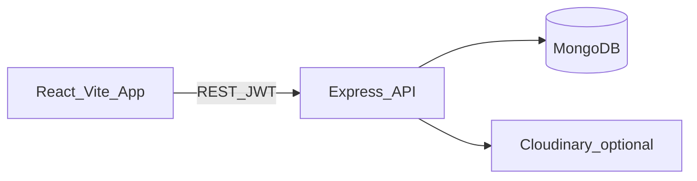

# Boardgame Rental

A full-stack web application for browsing, renting, and returning board games. Customers can search the catalog, build a rental cart, and complete checkout. Admins and staff manage inventory and monitor rentals from a dedicated dashboard.

**Stack:** Node.js · React · MongoDB · Express

---

## Features

### Customers

- Register and log in with JWT-based authentication
- Browse the catalog with filters for keyword, category, difficulty, player count, play time, price, and availability
- View game details and add titles to a rental cart
- Multi-item checkout with configurable rental period, deposit calculation, and payment via Bank Transfer or simulated Card payment
- Manage active rentals: return games, extend rentals, and leave reviews after return

### Admin / Staff

- Admin dashboard for game CRUD, image upload, and a rentals overview table
- Role-based access: `admin`, `staff`, and `customer`

---

## Tech Stack

| Layer | Technologies |
|-------|-------------|
| Frontend | React 19, Vite 8, React Router 6, Axios |
| Backend | Node.js, Express 4, Mongoose 7 |
| Auth | JWT (`jsonwebtoken`), bcrypt |
| Storage | MongoDB; optional Cloudinary for uploaded images; local `backend/uploads/` fallback |
| Validation | `express-validator` on auth routes |

---

## Architecture



---

## Project Structure

```
Boardgame Rental/
├── backend/          # Express API, models, scripts
├── frontend/         # React SPA
├── DEMO.md           # Quick demo script
└── README.md
```

---

## Prerequisites

- Node.js 18+ (LTS recommended)
- MongoDB instance (local or Atlas) with a connection string
- Optional: Cloudinary account for cloud image uploads

---

## Getting Started

### 1. Install dependencies

```bash
cd backend && npm install
cd ../frontend && npm install
```

### 2. Configure backend environment

Create `backend/.env` (this file is gitignored). Required and optional variables:

| Variable | Required | Notes |
|----------|----------|-------|
| `MONGO_URI` | Yes | MongoDB connection string |
| `JWT_SECRET` | Yes | Secret for signing tokens |
| `JWT_EXPIRES_IN` | No | Default `1h` |
| `PORT` | No | Default `5000` |
| `CLOUDINARY_CLOUD_NAME` | No | If unset, uploads use local storage |
| `CLOUDINARY_API_KEY` | No | Cloudinary API key |
| `CLOUDINARY_API_SECRET` | No | Cloudinary API secret |
| `API_BASE_URL` | No | Used by scripts; defaults to localhost |

Verify your configuration:

```bash
cd backend && npm run check-env
```

### 3. Seed demo data (optional)

```bash
cd backend && npm run seed-demo
```

Demo accounts:

| Email | Password | Role |
|-------|----------|------|
| `admin@demo.com` | `demo1234` | admin |
| `customer@demo.com` | `demo1234` | customer |

This seeds four sample games (Catan, Ticket to Ride, Codenames, Pandemic) if the database is empty.

### 4. Run the development servers

```bash
# Terminal 1 — backend (wait for "MongoDB Connected")
cd backend && npm run dev

# Terminal 2 — frontend
cd frontend && npm run dev
```

- API: `http://localhost:5000`
- Frontend: Vite default, typically `http://localhost:5173`

The frontend API base URL is set in `frontend/src/api/axios.js` as `http://localhost:5000/api`. Update this if you deploy to a different host.

---

## Demo Walkthrough (~10 min)

1. Log in as **admin@demo.com** → open `/admin` (stats, add game, rentals table)
2. Log out → log in as **customer@demo.com**
3. **Home** → open a game → **Rent Now** → complete **Checkout**
4. **Rentals** (navbar) → `/rentals/history` → **Return Game**
5. Log in as admin again → confirm the rental appears in the dashboard

For a condensed quick-start, see [DEMO.md](DEMO.md).

Card payment in checkout is a simulated UI flow for demo purposes — no real payment processor is integrated.

---

## Utility Scripts

Run these from the `backend` directory:

| Command | Purpose |
|---------|---------|
| `npm run check-env` | Verify required environment variables |
| `npm run seed-demo` | Create demo users and sample games |
| `npm run promote-admin -- your@email.com` | Promote an existing user to admin |
| `npm run rehearse-demo` | API smoke test (backend must be running) |

---

## API Overview

All endpoints are prefixed with `/api`. Most routes require a valid JWT in the `Authorization: Bearer <token>` header.

### Auth

- `POST /auth/register` — create a new customer account
- `POST /auth/login` — authenticate and receive a JWT

### Boardgames

- `GET /boardgames` — list games (paginated, filterable)
- `GET /boardgames/search` — search games
- `GET /boardgames/:id` — get a single game
- `POST /boardgames` — create a game (admin/staff)
- `PUT /boardgames/:id` — update a game (admin/staff)
- `DELETE /boardgames/:id` — delete a game (admin)

### Rentals

- `POST /rentals` — rent a single game
- `POST /rentals/checkout` — checkout multiple games from cart
- `PUT /rentals/:id/return` — return a rented game
- `PUT /rentals/:id/extend` — extend an active rental
- `PUT /rentals/:id/review` — review a returned rental
- `GET /rentals/history` — rental history for the current user
- `GET /rentals` — all rentals (admin/staff)

### Dashboard

- `GET /dashboard` — basic health check route
- `GET /dashboard/stats` — placeholder stats endpoint

Route definitions: [auth.routes.js](backend/routes/auth.routes.js), [boardgame.routes.js](backend/routes/boardgame.routes.js), [rental.routes.js](backend/routes/rental.routes.js).

---

## Documentation

Course and design documentation:

- [System Architecture](docs/architecture.md) — layered architecture, deployment view, checkout sequence diagram
- [Use Case Diagram](docs/use-case-diagram.md) — actors, use cases, UML relationships, traceability table
- [PlantUML source](docs/diagrams/use-case.puml) — export formal use case diagram to PNG/PDF

---

## Screenshots

Add screenshots of the Home page, Checkout flow, and Admin Dashboard here.

---

## License

Specify a license if needed.
