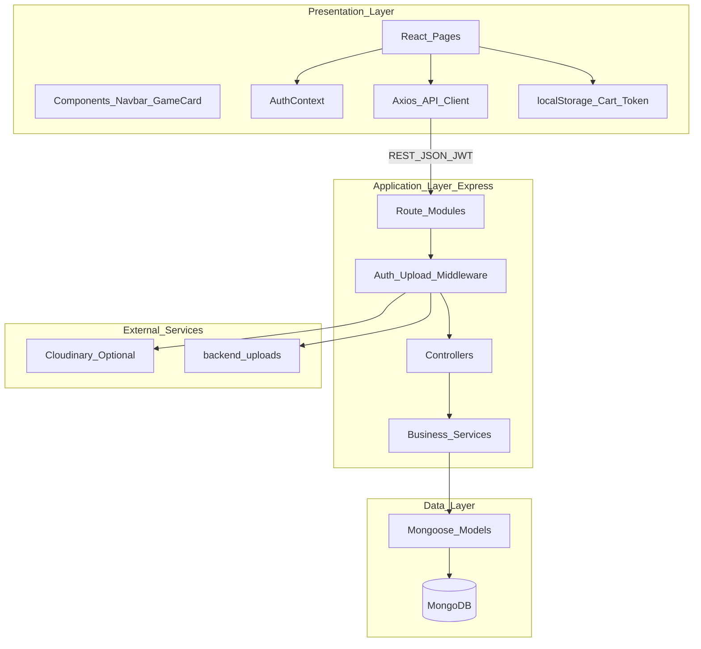
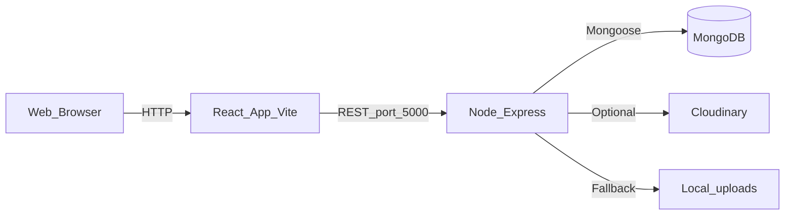
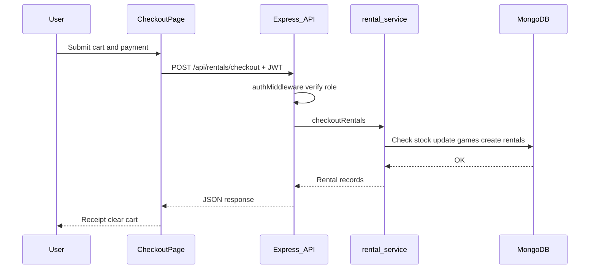

# System Architecture

Boardgame Rental follows a **3-tier web architecture**: a React single-page application (presentation), a Node.js/Express REST API (application and business logic), and MongoDB (data persistence). Optional Cloudinary integration handles game image uploads when configured; otherwise images are stored locally in `backend/uploads/`.

## Architectural Context

- **Client:** React SPA served by Vite during development; communicates with the API over HTTP using JSON and JWT bearer tokens.
- **Server:** Express application exposing `/api/*` routes with role-based access control (`customer`, `staff`, `admin`).
- **Database:** MongoDB accessed through Mongoose models for users, board games, and rentals.
- **Separation of concerns:** The UI never touches the database directly. Controllers orchestrate requests and delegate business rules to service modules. Models define schemas and validation at the persistence layer.

## Layered Architecture

## Layer-to-Code Mapping

| Layer | Responsibility | Codebase |
|-------|----------------|----------|
| **Presentation** | UI, routing, client state | `frontend/src/pages/`, `frontend/src/components/`, `frontend/src/context/AuthContext.jsx`, `frontend/src/api/axios.js` |
| **Application** | HTTP API, auth, request orchestration | `backend/routes/`, `backend/controllers/`, `backend/middleware/auth.middleware.js`, `backend/middleware/uploadMiddleware.js` |
| **Business logic** | Rental rules, inventory, pricing | `backend/services/rental.service.js`, `backend/services/inventory.service.js`, `backend/services/user.service.js` |
| **Data** | Persistence schemas | `backend/models/User.js`, `backend/models/Boardgame.js`, `backend/models/Rental.js` |
| **External** | File and document storage | MongoDB via Mongoose; Cloudinary or `backend/uploads/` |

## Security Boundary

Authentication uses JWT tokens issued on login. The `authMiddleware` in `backend/middleware/auth.middleware.js` validates the token on protected routes and enforces role checks where required. For example, deleting a board game requires the `admin` role (`DELETE /api/boardgames/:id`), while creating and updating games require `admin` or `staff`.

Client-side, tokens and user data are stored in `localStorage`. The Axios client attaches the token to every API request via an interceptor.

## Deployment View

Typical local development:

- Frontend: `http://localhost:5173` (Vite default)
- Backend API: `http://localhost:5000`
- MongoDB: local instance or MongoDB Atlas

The frontend API base URL is configured in `frontend/src/api/axios.js` as `http://localhost:5000/api`. Update this when deploying to a different host.

## Request Flow: Checkout Rentals

The checkout flow illustrates how layers interact when a customer completes a multi-item rental.

**Business rules applied during checkout** (in `rental.service.js`):

- Rental amount = `rentalPrice × quantity × days`
- Deposit = `rentalPrice × quantity × 2`
- Available stock is decremented; games marked `OutOfStock` when quantity reaches zero

**Assumption:** Card payment in the checkout UI is simulated for demo purposes. No external payment processor is integrated.

## Related Documentation

- [Use Case Diagram](use-case-diagram.md)
- [README](../README.md)
