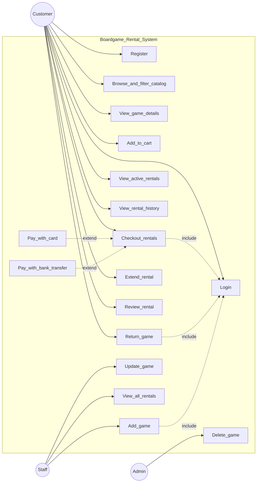

# Use Case Diagram

This document defines the UML use case model for the Boardgame Rental system. It maps actors, use cases, and relationships to the implemented pages and API routes.

## System Boundary

All use cases below are inside the **Boardgame Rental System** boundary. External actors interact with the system through the web UI and REST API.

## Actors

| Actor | Description | Role in codebase |
|-------|-------------|------------------|
| **Customer** | Registers, browses the catalog, rents games, manages returns and reviews | Default role in `backend/models/User.js`; rental routes allow `customer` |
| **Staff** | Manages inventory and views all rentals | `staff` role; create/update games, `GET /rentals` |
| **Admin** | Full inventory control including delete | `admin` role; `DELETE /boardgames/:id` |

**UML generalization (recommended for formal diagrams):** `Admin` —|> `Staff`. Both Staff and Customer perform authenticated actions that require login. You may introduce an abstract `AuthenticatedUser` actor if your course requires it.

MongoDB and Cloudinary are **not** modeled as actors; they appear in the [architecture diagram](architecture.md).

## Use Case Diagram

For formal UML submission (PNG/PDF), export from PlantUML using [`diagrams/use-case.puml`](diagrams/use-case.puml) via [plantuml.com](https://www.plantuml.com/plantuml) or the VS Code PlantUML extension.

## Use Cases by Functional Area

### Authentication

| Use case | Actor | Implementation |
|----------|-------|----------------|
| Register account | Customer | `POST /api/auth/register`, `frontend/src/pages/Register.jsx` |
| Login | Customer, Staff, Admin | `POST /api/auth/login`, `frontend/src/pages/Login.jsx` |
| Logout | All authenticated users | `frontend/src/context/AuthContext.jsx` |

### Catalog

| Use case | Actor | Implementation |
|----------|-------|----------------|
| Browse and filter catalog | Customer | `GET /api/boardgames`, `frontend/src/pages/Home.jsx` |
| Search games | Customer | `GET /api/boardgames/search` |
| View game details | Customer | `GET /api/boardgames/:id`, `frontend/src/pages/BoardgameDetail.jsx` |

### Rental

| Use case | Actor | Implementation |
|----------|-------|----------------|
| Add game to cart | Customer | localStorage cart, `frontend/src/pages/BoardgameDetail.jsx`, `Checkout.jsx` |
| Checkout rentals | Customer | `POST /api/rentals/checkout`, `frontend/src/pages/Checkout.jsx` |
| View active rentals | Customer | `frontend/src/pages/Rentals.jsx` |
| View rental history | Customer | `GET /api/rentals/history`, `frontend/src/pages/RentalHistory.jsx` |
| Return game | Customer | `PUT /api/rentals/:id/return` |
| Extend rental | Customer | `PUT /api/rentals/:id/extend` |
| Review returned rental | Customer | `PUT /api/rentals/:id/review` |

### Inventory Management

| Use case | Actor | Implementation |
|----------|-------|----------------|
| Add game | Staff, Admin | `POST /api/boardgames`, `frontend/src/pages/AdminDashboard.jsx` |
| Update game | Staff, Admin | `PUT /api/boardgames/:id` |
| Delete game | Admin only | `DELETE /api/boardgames/:id` |
| Upload game image | Staff, Admin | `backend/middleware/uploadMiddleware.js` |

### Operations

| Use case | Actor | Implementation |
|----------|-------|----------------|
| View all rentals | Staff, Admin | `GET /api/rentals`, admin dashboard rentals table |

## UML Relationships

| Relationship | From | To | Rationale |
|--------------|------|-----|-----------|
| `<<include>>` | Checkout rentals | Login | API requires JWT; unauthenticated users are redirected |
| `<<include>>` | Return game | Login | Protected rental route |
| `<<include>>` | Add game | Login | Admin routes use `authMiddleware(['admin', 'staff'])` |
| `<<extend>>` | Pay with card | Checkout rentals | Optional branch in `Checkout.jsx` (simulated payment) |
| `<<extend>>` | Pay with bank transfer | Checkout rentals | Alternative payment path at checkout |

## Assumptions and Notes

- **Authenticated browsing:** All boardgame list and detail endpoints require a valid JWT in the current implementation.
- **Card payment:** The card payment flow is a simulated UI for demonstration; no real payment gateway is connected.
- **Staff vs Admin:** Staff can create and update games; only Admin can delete games.

## Related Documentation

- [System Architecture](architecture.md)
- [README](../README.md)
